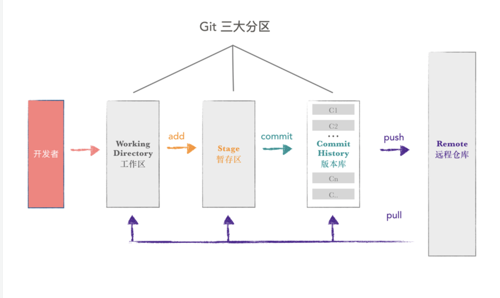

# git常用命令

> 记录的都是自己学习的记录，如果不对，欢迎指正。



## git在项目里常用命令
- `git clone <git项目地址> -b dev` **下载一个项目**，指定分支不是必须的，默认master
- `git add . ` 将工作区的修改提交到暂存区，.表示所有
- `git commit -m '描述' ` 将暂存区的修改提交到当前分支
- `git pull` 从远程更新代码
- `git push origin master` 将本地代码更新到远程分支上
- `git status ` 查看当前仓库的状态
- `git diff ` 查看修改
- `git log ` 查看提交历史
- `git checkout -- '文件地址' `  把没有add过的文件抹除
- `git checkout branch ` 切换分支
- `git checkout -b branchname master`  基于master创建一个branchname分支，-b表示不存在则创建
- `git branch`  显示当前分支
- `git branch branchname` 创建分支
- `git branch -a ` 显示本地所有分支，如果看不到某些远程分支，可以先`git fetch `
- `git branch -d branchname`  删除分支
- `git merge` 合并分支，也有的用`git rebase`
- `git fetch ` 同步远程分支
- `git reset ` 回退到某一个版本，这个命令有很多用法，**慎用**
- `git reset --hard ` 撤销所有本地修改
- `git revert HEAD ` 撤销前一次`commit`
- `git reset --hard HEAD^ ` 撤销所有本地到上一次修改
- `git reset --soft HEAD^ ` 撤销上一次`commit`，将`commit`的文件撤回暂存区
- `ggit tag -a tagName -m "my tag"` 打一个标签
- `git push origin v1.0` 把tag推到远程服务器
- `git remote prune origin` 分支删除了，`git branch -a` 还显示，就执行这行代码


## 代码提交完整流程
1. `git add . ` 一般都是.，表示添加所有
2. `git commit -m "message" `
3. `git pull` (或者`git fetch` + `git rebase`）
4. `git status` 查看是否冲突，如果冲突，解决冲突，再开始第一步
5. `git push` 提交

## git查询代码量
```js
git log --author="username" --since=2020-03-27 --until=2020-04-02 --pretty=tformat: --numstat | awk '{ add += $1; subs += $2; loc += $1 - $2 } END { 
printf "added lines: %s, removed lines: %s, total lines: %s\n", add, subs, loc }' -;
```

## 本地目录提交到git仓库
如果你在本地初始化好项目后，再创建的git仓库，适合下面步骤：
1. `git init `
2. `git add .`
3. `git commit -m 'm'`
4. `git remote add origin gitURL`
5. `git push -u origin master -f`
