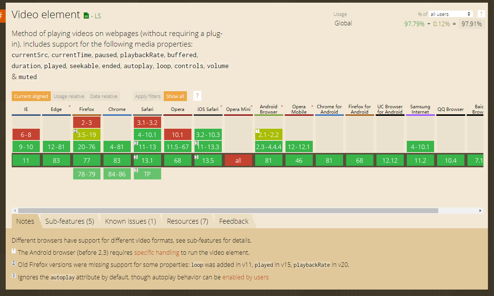

# 移动端H5视频播放
> 在H5页面中，一般都是用浏览器原生video标签，因为video标签在浏览器的支持还是蛮好的。

W3school上描述当前video标签支持三种视频格式：
格式 | IE| Firefox | Opera | Chrome | Safari
-- | -- | -- | -- | -- | --
Ogg | No | 3.5+ | 10.5+ | 5.0+ | No
MPEG 4 | 9.0+ | No | No | 5.0+ | 3.0+
WebM | No | 4.0+ | 10.6+ | 6.0+ | No

- MP4 : 带有 H.264 视频编码和 AAC 音频编码的 MPEG 4 文件
- WebM : 带有 VP8 视频编码和 Vorbis 音频编码的 WebM 文件
- Ogg : 带有 Theora 视频编码和 Vorbis 音频编码的 Ogg 文件

上面的图中显示，**mp4格式**是目前支持最好的视频格式，你也可以用source去支持多种视频格式。

由于video标签在各浏览器的控制组件表现不一致，特别是在安卓系统手机端，不能隐藏，且在各手机品牌间也存在差异。为了能在各端都有一个**统一的界面**，且能做一些统一的**错误处理**（不需要自己额外处理），提高**开发效率**，选择一款播放插件是不错的选择。

下面就几款播放插件做一些比对，大部分都是针对H5端的：

1. video.js   [网站](https://videojs.com/)

拥有世界上最流行的开源HTML5播放器框架。这是它官网上的描述。很多人在pc端页面都在用这个插件。

它是在video标签的基础上做的。

它能自动检测浏览器对 HTML5 的支持情况，如果不支持 HTML5 则自动使用 Flash 播放器。

格式：MP4、webm 、flv（插件支持）、HLS（苹果公司实现的基于HTTP的流媒体通信协议）和DASH（MEPG推出MEPG-DASH标准）

特点：
   1.	自定义css风格
   2.	支持响应式设计和Retina显示屏
   3.	易于定制字体图标
   4.	永久免费
   5.	小于100k

支持视频渲染宽高自定义，有默认的控制条

然而它在**H5手机端**却有点**不好用**，点击视频暂停后，点击控制组件播放不了（执行播放后又暂停了）。自定义的控制组件在安卓端也无效，在安卓端显示默认的video的控制组件。

2. flv.js   [git地址](https://github.com/bilibili/flv.js)  [参考](https://zhuanlan.zhihu.com/p/94440420)

除了原生video支持的，还**支持flv格式**，直播。

Flv.js内部把flv格式文件转成了mp4格式，再播放。

**没有默认的控制组件**，只有video标签自带的默认样式，或许是我没看到。

3. 腾讯云 Web 超级播放器   [网站](https://cloud.tencent.com/document/product/454/7503)

支持直播和点播，移动端支持MP4和M3U8格式（直播和点播）。

支持自定义提示语。在ios和安卓手机上都有较为统一的界面。

4. 七牛 Web 播放器 SDK   [网站](https://developer.qiniu.com/pili/sdk/4621/web-player-sdk)

目前支持 mp4、webm 和 m3u8，提供了一些配置选项用于给用户自定义视图。

### 总结

都支持MP4格式，插件和sdk大部分都支持m3u8格式直播和点播。flv.js支持.flv格式。

插件在界面上有一些不一致，如果在移动端设置，推荐3、4，pc端没试。

