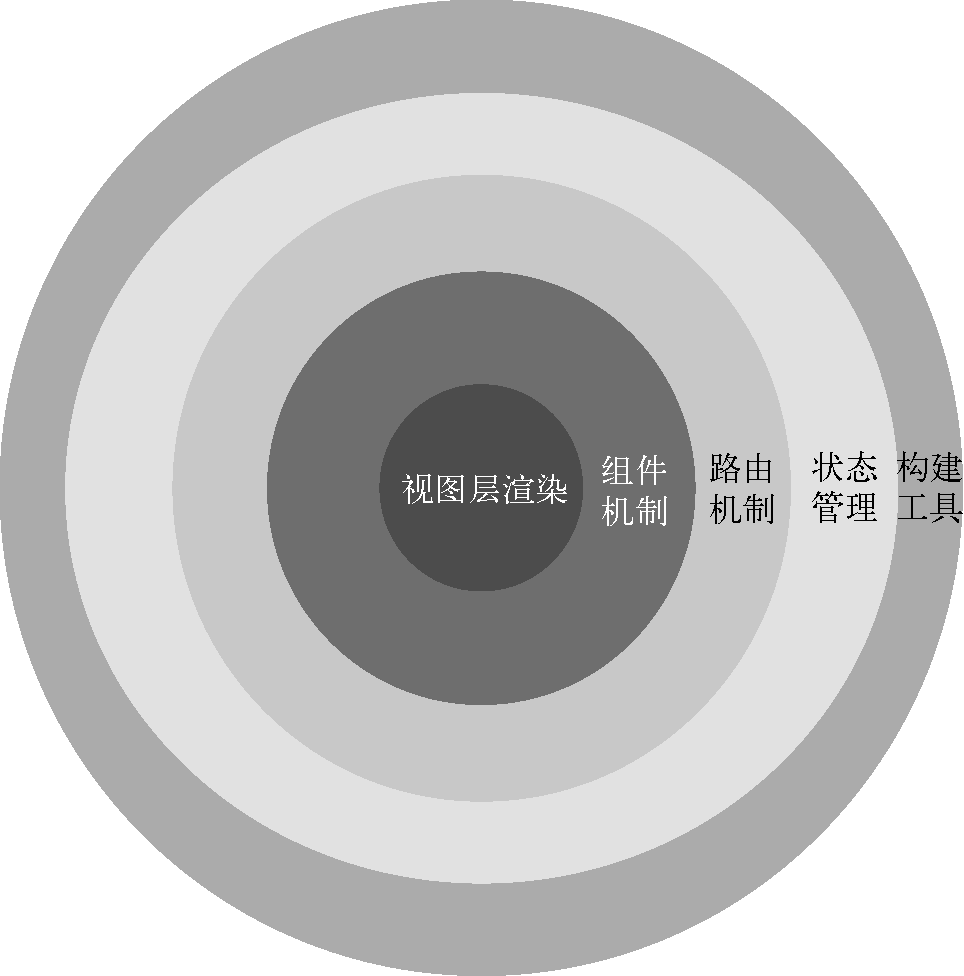

# 总体概况

## vue.js是什么

它是一套用于构建用户界面的**渐进式框架**。Vue 的核心库只关注视图层，往外是组件机制，在这个基础上再加入路由机制，再加入状态管理，最外面是构建工具。就是说你既可以只用最核心的视图层渲染功能来快速开发一些需求，也可以使用一整套全家桶来开发大型应用。
<div  align="center">
  
</div>

## 渲染流程

```html
<div id="app">
  {{ message }}
</div>
```

```js
var vm = new Vue({
  data: {
    message: 'Hello Vue!'
  }
}).$mount('#app')
```

### 构建

vue的npm构建脚本：
```js
// package.json

{
  "script": {
    "build": "node scripts/build.js",
    "build:ssr": "npm run build -- web-runtime-cjs,web-server-renderer",
    "build:weex": "npm run build -- weex",
  }
}
```

```js
// scripts/build.js

let builds = require('./config').getAllBuilds()

// filter builds via command line arg
if (process.argv[2]) {
  const filters = process.argv[2].split(',')
  builds = builds.filter(b => {
    return filters.some(f => b.output.file.indexOf(f) > -1 || b._name.indexOf(f) > -1)
  })
} else {
  // filter out weex builds by default
  builds = builds.filter(b => {
    return b.output.file.indexOf('weex') === -1
  })
}

build(builds) // 执行 rollup.rollup(config)
```
先从配置文件读取配置，再通过命令行参数对构建配置做过滤，这样就可以构建出不同用途的 Vue.js 了。配置文件，在 `scripts/config.js` 中：
```js
// scripts/config.js

const aliases = require('./alias')
const resolve = p => {
  const base = p.split('/')[0]
  if (aliases[base]) {
    return path.resolve(aliases[base], p.slice(base.length + 1))
  } else {
    return path.resolve(__dirname, '../', p)
  }
}

const builds = {
  // Runtime only (CommonJS). Used by bundlers e.g. Webpack & Browserify
  'web-runtime-cjs': {
    entry: resolve('web/entry-runtime.js'),
    dest: resolve('dist/vue.runtime.common.js'),
    format: 'cjs',
    banner
  },
  // Runtime+compiler CommonJS build (CommonJS)
  'web-full-cjs': {
    entry: resolve('web/entry-runtime-with-compiler.js'),
    dest: resolve('dist/vue.common.js'),
    format: 'cjs',
    alias: { he: './entity-decoder' },
    banner
  },
  // Runtime only (ES Modules). Used by bundlers that support ES Modules,
  // e.g. Rollup & Webpack 2
  'web-runtime-esm': {
    entry: resolve('web/entry-runtime.js'),
    dest: resolve('dist/vue.runtime.esm.js'),
    format: 'es',
    banner
  },
  // Runtime+compiler CommonJS build (ES Modules)
  'web-full-esm': {
    entry: resolve('web/entry-runtime-with-compiler.js'),
    dest: resolve('dist/vue.esm.js'),
    format: 'es',
    alias: { he: './entity-decoder' },
    banner
  },
  // runtime-only build (Browser)
  'web-runtime-dev': {
    entry: resolve('web/entry-runtime.js'),
    dest: resolve('dist/vue.runtime.js'),
    format: 'umd',
    env: 'development',
    banner
  },
  // runtime-only production build (Browser)
  'web-runtime-prod': {
    entry: resolve('web/entry-runtime.js'),
    dest: resolve('dist/vue.runtime.min.js'),
    format: 'umd',
    env: 'production',
    banner
  },
  // Runtime+compiler development build (Browser)
  'web-full-dev': {
    entry: resolve('web/entry-runtime-with-compiler.js'),
    dest: resolve('dist/vue.js'),
    format: 'umd',
    env: 'development',
    alias: { he: './entity-decoder' },
    banner
  },
  // Runtime+compiler production build  (Browser)
  'web-full-prod': {
    entry: resolve('web/entry-runtime-with-compiler.js'),
    dest: resolve('dist/vue.min.js'),
    format: 'umd',
    env: 'production',
    alias: { he: './entity-decoder' },
    banner
  },
  // ...
}
```
这些单个配置都是遵循 `Rollup` 的构建规则的。
- `entry` 属性表示构建的入口 `JS` 文件地址
- `dest` 属性表示构建后的 `JS` 文件地址
- `format` 属性表示构建的格式
- `cjs` 表示构建出来的文件遵循 `CommonJS` 规范
- `es` 表示构建出来的文件遵循 `ES Module` 规范
- `umd` 表示构建出来的文件遵循 `UMD` 规范

```js
// scripts/alias.js

const path = require('path')

const resolve = p => path.resolve(__dirname, '../', p)

module.exports = {
  vue: resolve('src/platforms/web/entry-runtime-with-compiler'),
  compiler: resolve('src/compiler'),
  core: resolve('src/core'),
  shared: resolve('src/shared'),
  web: resolve('src/platforms/web'),
  weex: resolve('src/platforms/weex'),
  server: resolve('src/server'),
  sfc: resolve('src/sfc')
}
```
由此，我们可以看到 `web-full-esm` 配置的入口文件就是 `src/platforms/web/entry-runtime-with-compiler.js`。

### Runtime Only VS Runtime + Compiler

我们从上面的配置可以看到，`vue` 有 `Runtime Only` 和 `Runtime + Compiler` 版本。

`Runtime Only`版本只包含运行时的代码，体积更小。在使用的时候，通常需要借助如 `webpack` 的 `vue-loader` 工具把 `.vue` 文件编译成 `JavaScript`
```js
// 这种情况不需要编译
new Vue({
  render (h) {
    return h('div', this.hi)
  }
})
```

`Runtime + Compiler` 版本包含编译部分的代码，体积更大。
```js
// 需要编译器的版本
new Vue({
  template: '<div>{{ hi }}</div>'
})
```

### 入口

我们分析的版本是 `Runtime + Compiler` 版本，因为它包含了编译部分的代码，它的入口是 `src/platforms/web/entry-runtime-with-compiler.js`

```js
/* @flow */

import config from 'core/config'
import { warn, cached } from 'core/util/index'
import { mark, measure } from 'core/util/perf'

import Vue from './runtime/index'
import { query } from './util/index'
import { compileToFunctions } from './compiler/index'
import { shouldDecodeNewlines, shouldDecodeNewlinesForHref } from './util/compat'

const idToTemplate = cached(id => {
  const el = query(id)
  return el && el.innerHTML
})

const mount = Vue.prototype.$mount
Vue.prototype.$mount = function (
  el?: string | Element,
  hydrating?: boolean
): Component {
  el = el && query(el)

  /* istanbul ignore if */
  if (el === document.body || el === document.documentElement) {
    process.env.NODE_ENV !== 'production' && warn(
      `Do not mount Vue to <html> or <body> - mount to normal elements instead.`
    )
    return this
  }

  const options = this.$options
  // resolve template/el and convert to render function
  if (!options.render) {
    let template = options.template
    if (template) {
      if (typeof template === 'string') {
        if (template.charAt(0) === '#') {
          template = idToTemplate(template)
          /* istanbul ignore if */
          if (process.env.NODE_ENV !== 'production' && !template) {
            warn(
              `Template element not found or is empty: ${options.template}`,
              this
            )
          }
        }
      } else if (template.nodeType) {
        template = template.innerHTML
      } else {
        if (process.env.NODE_ENV !== 'production') {
          warn('invalid template option:' + template, this)
        }
        return this
      }
    } else if (el) {
      template = getOuterHTML(el)
    }
    if (template) {
      /* istanbul ignore if */
      if (process.env.NODE_ENV !== 'production' && config.performance && mark) {
        mark('compile')
      }

      const { render, staticRenderFns } = compileToFunctions(template, {
        outputSourceRange: process.env.NODE_ENV !== 'production',
        shouldDecodeNewlines,
        shouldDecodeNewlinesForHref,
        delimiters: options.delimiters,
        comments: options.comments
      }, this)
      options.render = render
      options.staticRenderFns = staticRenderFns

      /* istanbul ignore if */
      if (process.env.NODE_ENV !== 'production' && config.performance && mark) {
        mark('compile end')
        measure(`vue ${this._name} compile`, 'compile', 'compile end')
      }
    }
  }
  return mount.call(this, el, hydrating)
}

/**
 * Get outerHTML of elements, taking care
 * of SVG elements in IE as well.
 */
function getOuterHTML (el: Element): string {
  if (el.outerHTML) {
    return el.outerHTML
  } else {
    const container = document.createElement('div')
    container.appendChild(el.cloneNode(true))
    return container.innerHTML
  }
}

Vue.compile = compileToFunctions

export default Vue

```
`import Vue from './runtime/index'` 从 `src/platforms/web/runtime/index.js` 中引入 `Vue`。这个文件主要做的事就是缓存了 `Vue.prototype.$mount` 方法，然后重写了 `Vue.prototype.$mount`，最后执行缓存的 `mount` 方法。具体细节在后面去分析。

`src/platforms/web/runtime/index.js`：

```js
import Vue from 'core/index'
import config from 'core/config'
import { extend, noop } from 'shared/util'
import { mountComponent } from 'core/instance/lifecycle'
import { devtools, inBrowser, isChrome } from 'core/util/index'

import {
  query,
  mustUseProp,
  isReservedTag,
  isReservedAttr,
  getTagNamespace,
  isUnknownElement
} from 'web/util/index'

import { patch } from './patch'
import platformDirectives from './directives/index'
import platformComponents from './components/index'

// install platform specific utils
Vue.config.mustUseProp = mustUseProp
Vue.config.isReservedTag = isReservedTag
Vue.config.isReservedAttr = isReservedAttr
Vue.config.getTagNamespace = getTagNamespace
Vue.config.isUnknownElement = isUnknownElement

// install platform runtime directives & components
extend(Vue.options.directives, platformDirectives)
extend(Vue.options.components, platformComponents)

// install platform patch function
Vue.prototype.__patch__ = inBrowser ? patch : noop

// public mount method
Vue.prototype.$mount = function (
  el?: string | Element,
  hydrating?: boolean
): Component {
  el = el && inBrowser ? query(el) : undefined
  return mountComponent(this, el, hydrating)
}

// ...

export default Vue
```

`src/core/index.js`:
```js
import Vue from './instance/index'
import { initGlobalAPI } from './global-api/index'
import { isServerRendering } from 'core/util/env'
import { FunctionalRenderContext } from 'core/vdom/create-functional-component'

initGlobalAPI(Vue)

Object.defineProperty(Vue.prototype, '$isServer', {
  get: isServerRendering
})

Object.defineProperty(Vue.prototype, '$ssrContext', {
  get () {
    /* istanbul ignore next */
    return this.$vnode && this.$vnode.ssrContext
  }
})

// expose FunctionalRenderContext for ssr runtime helper installation
Object.defineProperty(Vue, 'FunctionalRenderContext', {
  value: FunctionalRenderContext
})

Vue.version = '__VERSION__'

export default Vue
```
`initGlobalAPI` 主要是在Vue上扩展静态方法或属性。

### Vue构造函数
在 `src/core/instance/index.js` 中终于找到Vue构造函数
```js
import { initMixin } from './init'
import { stateMixin } from './state'
import { renderMixin } from './render'
import { eventsMixin } from './events'
import { lifecycleMixin } from './lifecycle'
import { warn } from '../util/index'

function Vue (options) {
  if (process.env.NODE_ENV !== 'production' &&
    !(this instanceof Vue)
  ) {
    warn('Vue is a constructor and should be called with the `new` keyword')
  }
  this._init(options)
}

initMixin(Vue)
stateMixin(Vue)
eventsMixin(Vue)
lifecycleMixin(Vue)
renderMixin(Vue)

export default Vue
```

我们知道，通过new去实例化一个对象，可以是一个构造函数实现的类，也可以是一个Class实现的类，这里为什么要用构造函数呢？我们往后看这里有很多 `xxxMixin` 的函数调用，并把 `Vue` 当参数传入，它们的功能都是给 Vue 的 prototype 上扩展一些方法，`Vue` 按功能把这些扩展分散到多个模块中去实现，而不是在一个模块里实现所有，这种方式是用 Class 难以实现的。这么做的好处是非常方便代码的维护和管理。

## new Vue

```js
function Vue (options) {
  if (process.env.NODE_ENV !== 'production' &&
    !(this instanceof Vue)
  ) {
    warn('Vue is a constructor and should be called with the `new` keyword')
  }
  this._init(options)
}
```
在执行 `new Vue(...)` 的时候，首先判断了在非生产环境下，实例是不是由 `new` 来实例化的，如果不是，则提出警告。然后执行了 `this._init(options)` 方法，该方法在 `src/core/instance/init.js` 中：

```js
let uid = 0

Vue.prototype._init = function (options?: Object) {
  const vm: Component = this
  // a uid
  vm._uid = uid++

  // 性能追踪
  let startTag, endTag
  /* istanbul ignore if */
  if (process.env.NODE_ENV !== 'production' && config.performance && mark) {
    startTag = `vue-perf-start:${vm._uid}`
    endTag = `vue-perf-end:${vm._uid}`
    mark(startTag)
  }

  // a flag to avoid this being observed
  vm._isVue = true
  // merge options
  if (options && options._isComponent) {
    // optimize internal component instantiation
    // since dynamic options merging is pretty slow, and none of the
    // internal component options needs special treatment.
    initInternalComponent(vm, options)
  } else {
    vm.$options = mergeOptions(
      resolveConstructorOptions(vm.constructor),
      options || {},
      vm
    )
  }
  /* istanbul ignore else */
  if (process.env.NODE_ENV !== 'production') {
    initProxy(vm)
  } else {
    vm._renderProxy = vm
  }
  // expose real self
  vm._self = vm
  initLifecycle(vm)
  initEvents(vm)
  initRender(vm)
  callHook(vm, 'beforeCreate')
  initInjections(vm) // resolve injections before data/props
  initState(vm)
  initProvide(vm) // resolve provide after data/props
  callHook(vm, 'created')

  /* istanbul ignore if */
  if (process.env.NODE_ENV !== 'production' && config.performance && mark) {
    vm._name = formatComponentName(vm, false)
    mark(endTag)
    measure(`vue ${vm._name} init`, startTag, endTag)
  }

  if (vm.$options.el) {
    vm.$mount(vm.$options.el)
  }
}
```