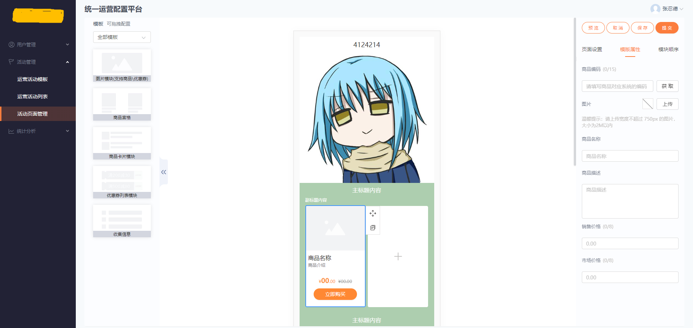
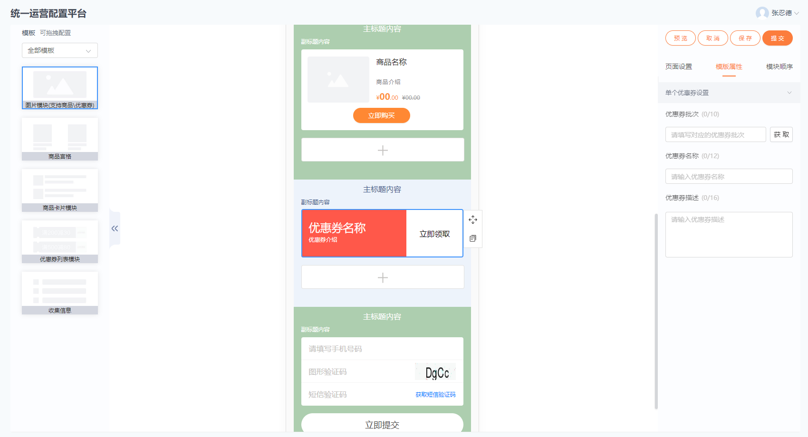

# 关于我

我，**张忍德**，2008年毕业于一所普通大学，目前在**北京**工作。

大学里学的是**动画专业**，毕业后从事**美术相关**工作，2014年开始接触**web前端**，并从事web前端工作至今。

先后待过创业公司、p2p公司、外包公司和健康管理公司。写过较多**移动端和pc端web页面**，少量**微信小程序**。

**最近1年**的工作重要做基础支持，如：**活动运营管理系统、组件库、项目模板**，以及哪个项目需要人就支援哪个项目。

[我的网站](https://www.p-80.net/)

[我的文档](http://d.p-80.net/)

[我的github](https://github.com/1985zrd)

### 活动运营管理系统

我主要负责图片模块和右侧部分（预览、取消、保存、提交、模块排序、部分模板属性）和活动页展示页。

1. 项目背景
运营最常用的方式就是通过节假日策划活动，快速增加收入及拉动新用户增长；不仅如此，新媒体运营作为蹭热点事件增加关注度的方式更需要有时效性，需要快速设计及上线，迅速曝光在各大平台，但现阶段活动所需的前端资源及UI资源不足，且研发周期相对稍长

2. 项目目的
 将运营活动（指活动的落地页、商品的专题页、甚至于APP的首页部分运营位等）可配置化，定制通用的模板及组件，由运营人员自助式配置，减少前端技术人员及UI人员的依赖，可进行快速的上线

3. 用到的技术
`react`、`react-dnd`、`react-router`、`react-redux`、`antd`、`axios`

4. 主要流程
   1. 前端从后端获取模板，点击或拖拽模板生成页面，右侧可以设置模板参数，可以拖拽排序。
   2. 点击预览，提交页面数据，后端会返回一个活动展示页URL并带上一个获取页面数据的id，前端生成二维码展示，这时后端保存临时数据。
   3. 手机扫码预览，通过接口获取页面数据并展示。
   4. 提交后保存数据，返回id
   5. 上架，提交id，后端把页面数据以文件形式保存到cdn服务器，并返回活动URL链接带活动id。
   6. 上架后的活动页，前端是通过jsonp获取数据
   7. 下架，提交id，后端把页面数据从cdn服务器删除
   8. 是否上架有字段区别

5. 难点
- 技术上：主要是拖拽，我在后面有写拖拽部分是怎么实现的。
- 业务上：场景比较多，要在多个平台，多个项目中运行。参考了旧项目的逻辑（旧项目也在并行中，当前项目还满足不了所有场景，旧项目是angular1.5.5单页应用）。

6. 最终效果

  
  
  <!-- 
  
   -->

  

### 组件库
这是一个基于antd二次开发的组件库，也有部分是自己写的组件。

我主要写了login登录、skeleton骨架屏、result结果等等，参与了开发的整个流程。

相关技术以整理成文档 [基于vue的UI组件库开发(工程)](https://juejin.im/post/5ee98942f265da76ee1f6bae)

1. 项目背景
公司目前各个项目的ui表现都不统一，并且想要减少设计资源的重复浪费。

2. 项目目的
统一公司各管理系统的ui表现，减少设计师的重复设计，更好的维护项目。

 

